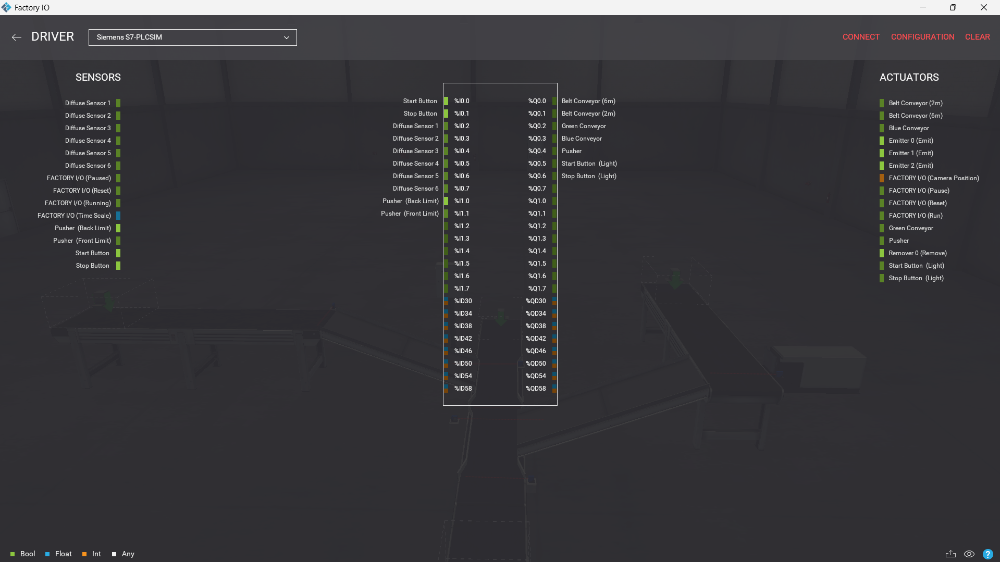
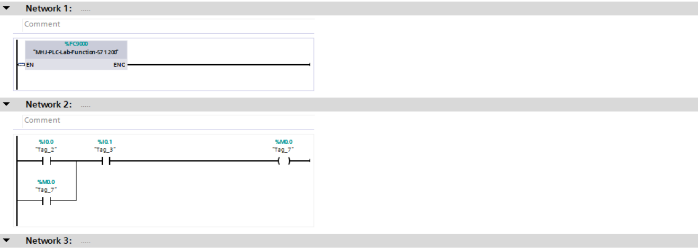
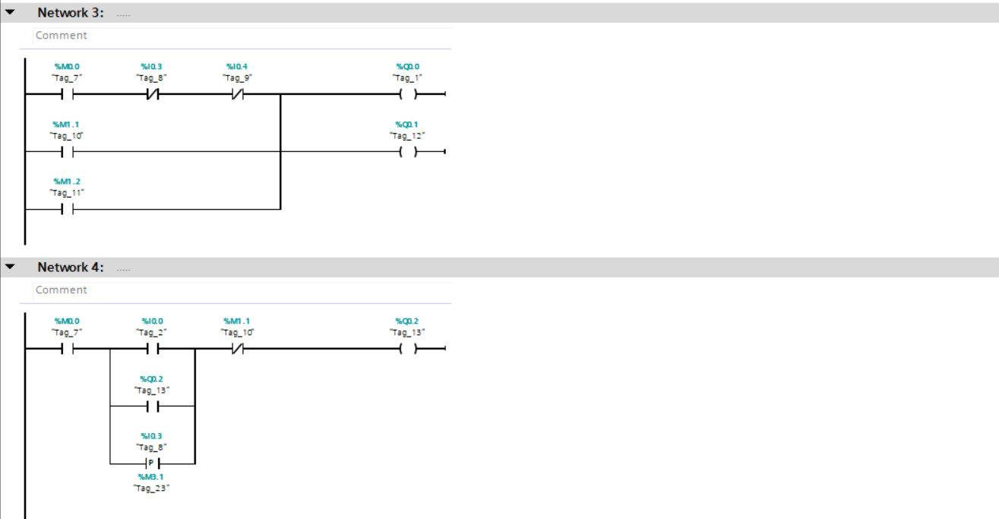
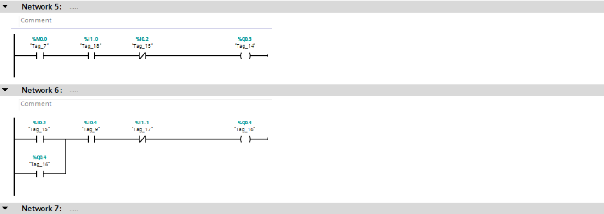
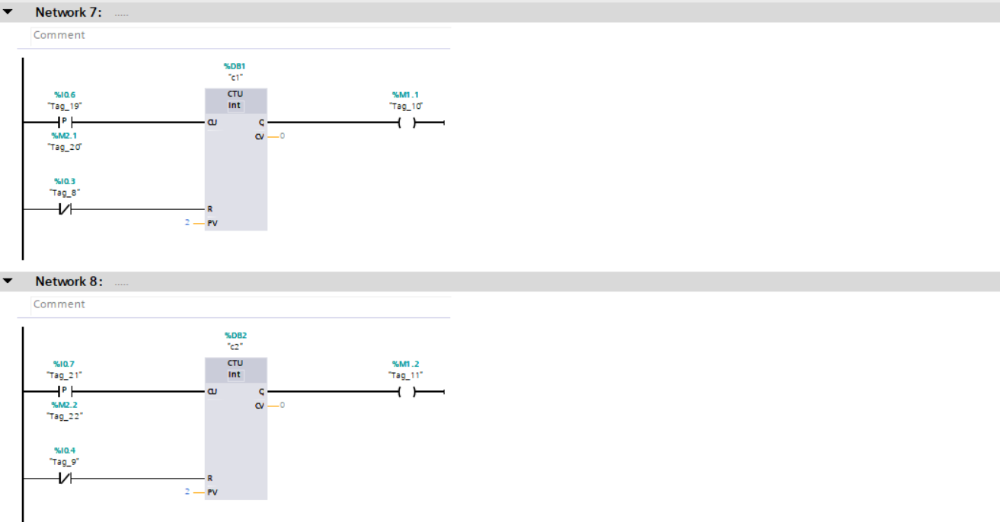
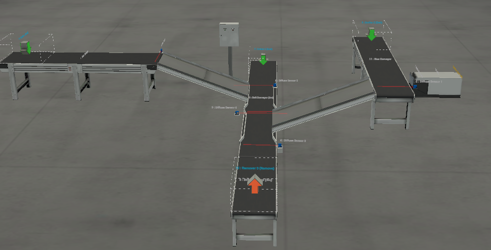

# Double-the-Colors-Automated-Filling-System
# 📦 Double the Colors: Carton Filling & Indexing System

## 📌 Project Overview

"Double the Colors" is an industrial automation project that simulates a **carton filling and indexing system** used in real packaging lines. Developed using **Siemens TIA Portal** and **Factory IO**, the system controls the movement of cartons and fills them with products based on a predefined sequence.

The system ensures each carton is filled with:

- **2 Green Items**
- **2 Blue Items**

using conveyors and a **pneumatic pusher mechanism**.

---

## 🛠 Technology Stack

- **PLC Programming:** Siemens TIA Portal (S7-1200)
- **Simulation:** Factory IO (Custom Scene)
- **Hardware Logic:** Conveyors & Pneumatic Pusher System
- **Sensors:** Photoelectric Sensors (Item Detection & Cart Position)
- **Communication:** Siemens S7-PLCSIM

---

## ⚙️ Advanced Control Strategy

This project demonstrates a **multi-stage sequential filling process**:

### 1. Cart Detection & Positioning
The carton moves on the main conveyor and stops precisely at the green filling station using position sensors.

### 2. Green Filling Stage
- Green items move freely on their conveyor  
- When the carton is in position, items drop directly into it  
- A counter ensures that only **2 green items** are loaded  

### 3. Indexing Process
- After green filling is complete, the main conveyor moves the carton forward  
- The carton stops at the blue filling station  

### 4. Blue Filling (Pusher Logic)
- Blue items require a **pneumatic pusher** to enter the carton  
- The pusher activates only when:
  - The carton is in position  
  - An item is detected in front of the pusher  
- The pusher extends and retracts to load items sequentially  
- The process repeats until **2 blue items** are loaded  

---

## 🧠 Technical Highlights

- **Sequential (Step-Based) Control**
  - System works as a state machine

- **Accurate Counting Logic**
  - Ensures each carton gets exactly required items

- **Interlocking Conditions**
  - Prevents incorrect operations (e.g., filling without carton)

- **Pneumatic Actuator Control**
  - Monostable pusher with extend/retract feedback

---

## 🔌 I/O Mapping

| Inputs (Sensors)         | Address   | Outputs (Actuators) | Address |
|--------------------------|----------|---------------------|--------|
| Start / Stop Buttons     | %I0.0 / %I0.1 | Main Conveyor       | %Q0.0  |
| Cart Position Sensor     | %I0.2    | Green Conveyor      | %Q0.1  |
| Green Item Sensor        | %I0.3    | Blue Conveyor       | %Q0.2  |
| Blue Item Sensor         | %I0.4    | Pneumatic Pusher    | %Q0.3  |
| Pusher Front/Back Limits | %I0.5 / %I0.6 | System Indicators | %Q0.X  |

---

## 📸 Project Documentation

### 🟡 Cart Positioning & Filling Logic

  
*Cart movement and positioning at filling stations.*

---

### 🧩 Sequential Ladder Logic

  
  
  
  
*Implementation of step-based logic and counting system.*

---

### 🏭 Simulation Environment

  
*3D layout showing conveyors, carton flow, and filling stations.*

---

## 📺 Demonstration

> 🎥 Watch the Carton Filling System in Action  
> *(Video shows full cycle: movement, green filling, indexing, blue pusher operation)*

---

## 🚀 Execution Instructions

1. Open the project in **TIA Portal V16 or later**
2. Compile and download to **S7-PLCSIM**
3. Open **Factory IO** and load the scene
4. Set driver to **Siemens S7-PLCSIM** and connect
5. Switch PLC to **RUN**
6. Start the system from the control panel

---

## 💡 Notes

- Fully step-based industrial automation logic
- Designed to simulate real packaging line behavior
- Easy to expand (add more colors / stations / sensors)

---
